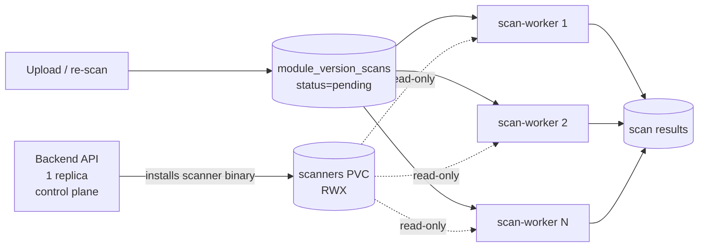

<!-- markdownlint-disable MD013 -->

# Dedicated Scan Workers

By default the backend scans modules **in-process**: a background job in the API
server polls the queue and runs the scanner. Because the backend runs as a
single replica (in-memory rate limiting, no shared cache), scanning throughput is
capped regardless of cluster size. For large upload bursts you can instead run
**dedicated scan-worker pods** that scale horizontally and independently of the
API server.

This is an **opt-in** deployment mode. Single-node and default installs are
unaffected — the backend keeps scanning in-process unless you enable workers.

## How it works

Scanning is queue-driven via the `module_version_scans` table. Claims are atomic
(`UPDATE ... WHERE status = 'pending' ... FOR UPDATE SKIP LOCKED`) and stale
`scanning` rows are automatically requeued after a visibility timeout, so any
number of workers can drain the queue concurrently without double-scanning.



- **Control plane** — the backend (1 replica) still owns install / activate /
  approve of the scanner binary and writes it to the shared scanners PVC.
- **Data plane** — worker pods (N replicas) mount that PVC **read-only** and
  execute the binary to drain the queue.

When workers are enabled the Helm chart sets `TFR_SCANNING_EMBEDDED_WORKER=false`
on the backend so it stops scanning in-process; the workers force the flag on for
themselves. The `scan-worker` process runs no HTTP server, exposes no ports, and
retries startup until the scanner binary is installed and activated.

## Requirements

- **Shared scanner binary storage.** Set `scanning.installDirPVC` to a
  **ReadWriteMany** PVC (e.g. Azure Files) so the backend can write the binary
  and every worker can read it. An `emptyDir` would be empty on each worker.
- **Image with the `scan-worker` subcommand.** Use a backend image that supports
  `terraform-registry scan-worker` (2.8.0+).
- **KEDA operator** (only if you enable `scannerWorker.keda`).

## Enabling workers (Helm)

```yaml
scanning:
  enabled: true
  tool: trivy
  installDir: /app/scanners
  installDirPVC: terraform-registry-scanners # shared RWX PVC

scannerWorker:
  enabled: true
  replicaCount: 2 # static count when KEDA is disabled
  resources:
    requests:
      cpu: 250m
      memory: 256Mi
    limits:
      cpu: "1"
      memory: 1Gi
```

The workers reuse `backend.extraEnv`, the config ConfigMap, and the app Secret, so
they inherit the same database and storage credentials as the backend
(for example an Azure storage account key injected via `backend.extraEnv`).

## Autoscaling with KEDA

Enable [KEDA](https://keda.sh) to scale workers on the depth of the pending
queue, including **scale-to-zero** when idle:

```yaml
scannerWorker:
  enabled: true
  keda:
    enabled: true
    targetPendingScans: 20 # desired replicas ≈ ceil(pending / 20)
    minReplicaCount: 0 # scale to zero when the queue is empty
    maxReplicaCount: 10
    pollingInterval: 30
    cooldownPeriod: 300
```

The chart renders a `ScaledObject` with a PostgreSQL trigger that counts pending
scans, plus a `TriggerAuthentication` that reads the DB password from the same
secret the app uses (`TFR_DATABASE_PASSWORD`). When KEDA is enabled it owns the
replica count, so `replicaCount` is ignored.

## Operational notes

- **Activating or updating the scanner requires a worker rollout.** The backend
  writes the binary to the PVC, but each worker resolves the binary at startup.
  After installing or upgrading the scanner, restart the workers:

  ```bash
  kubectl rollout restart deployment/<release>-scanner-worker -n <namespace>
  ```

- **Rollback.** Set `scannerWorker.enabled=false` to remove the workers; the
  backend automatically resumes in-process scanning (`TFR_SCANNING_EMBEDDED_WORKER`
  returns to `true`) on its next config reload/restart.

See [module-scanning.md](module-scanning.md) for scanner setup and the full
configuration reference.
